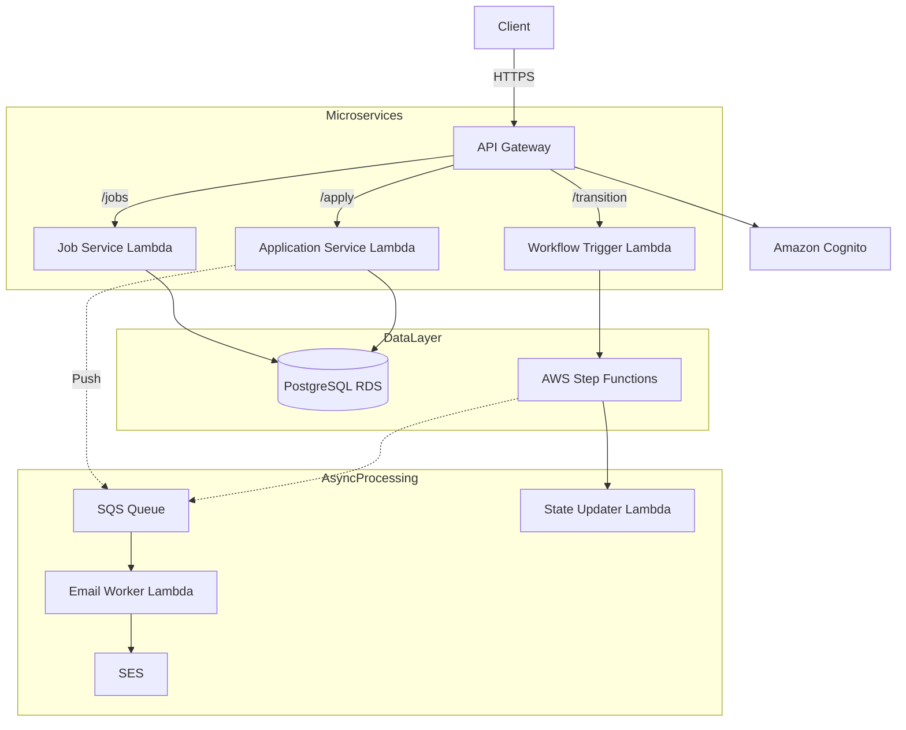
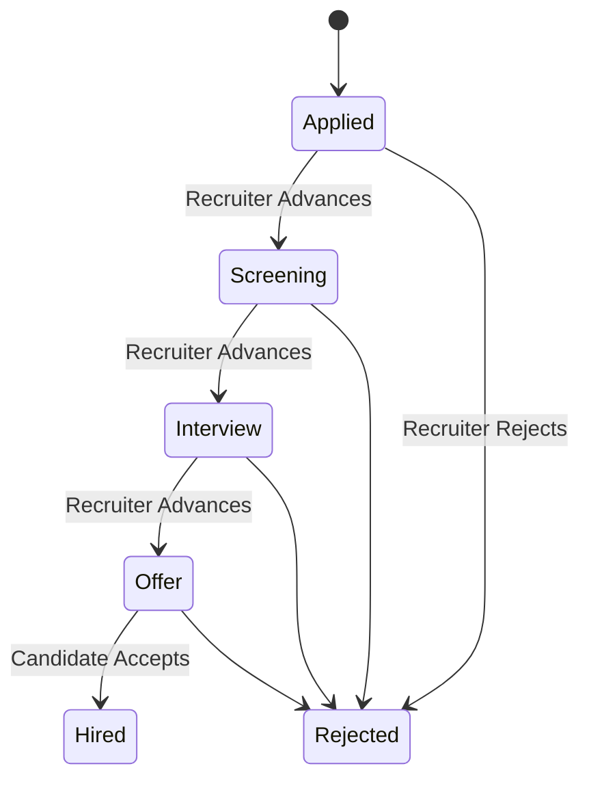
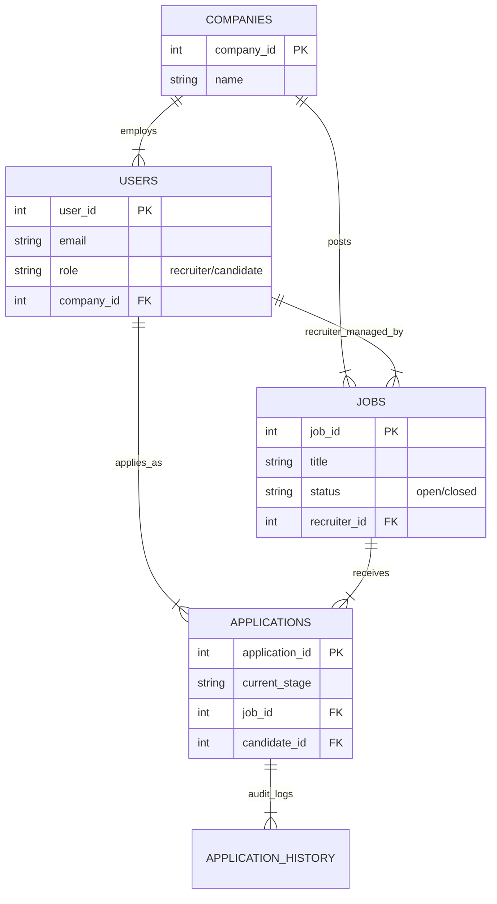

# Serverless Job Application Tracking System (ATS)


A cloud-native, event-driven **Serverless ATS** designed to manage high-volume recruitment workflows.  
Built with AWS Lambda, API Gateway, Cognito, Step Functions, SQS, SES, and PostgreSQL (RDS).  
This system ensures scalable hiring workflows, strict state transitions, background processing, and RBAC-driven access control.

---

## Demo & Documentation

**Video Demo:** [Demo_Video](https://drive.google.com/file/d/1yJ_yobNCIAC2kilqh5_zLDZzGd0n44EL/view?usp=sharing)  
**API Documentation:** [Postman Public API Docs](https://documenter.getpostman.com/view/48093520/2sB3dQw9rQ)

---

# Table of Contents

- [Architecture Overview](#architecture-overview)
- [Microservices](#microservices)
- [Workflow & State Management](#workflow--state-management)
- [Role-Based Access Control (RBAC)](#role-based-access-control-rbac)
- [Database Schema (ERD)](#database-schema-erd)
- [Folder Structure](#folder-structure)
- [Setup & Installation](#setup--installation)
- [Deployment Guide](#deployment-guide)
- [How to Test](#how-to-test)
- [Author](#author)
---

# Architecture Overview

This project follows a fully decoupled **microservices architecture** backed by event-driven messaging.  
The system ensures reliability, fault-tolerance, and high scalability using AWS-managed services.

### High-Level Architecture

1. **Amazon API Gateway** – RESTful entry point for all HTTPS API requests  
2. **Amazon Cognito** – Authentication, JWT issuance, RBAC claims  
3. **AWS Lambda** – Stateless compute for all services  
4. **Amazon RDS (PostgreSQL)** – Primary database  
5. **AWS Step Functions** – Manages candidate lifecycle state transitions  
6. **Amazon SQS + SES** – Asynchronous event queue + email notifications

---

## Microservices

| Microservice | Description |
|--------------|-------------|
| **ATS-Job-Service** | Create, read, update, delete job postings |
| **ATS-Application-Service** | Apply for jobs, view applicants, view application history |
| **ATS-User-Sync** | Sync Cognito users into PostgreSQL automatically |
| **ATS-Workflow-Trigger** | Orchestrator that triggers the Step Functions workflow |
| **ATS-State-Updater** | Updates database records when state transitions happen |
| **ATS-Email-Worker** | Sends emails asynchronously via SQS + SES |

---

## Data Flow Diagram



## Workflow & State Management
The application lifecycle is strictly enforced by AWS Step Functions. This prevents invalid state transitions (e.g., moving a candidate from "Applied" directly to "Hired" without an interview).

### Valid States: Applied → Screening → Interview → Offer → Hired / Rejected



## Role-Based Access Control (RBAC)

Security is implemented at both:
- **API Gateway level** (Authorizers)
- **Lambda level** (Business Logic Validation)

## Endpoint Permissions

| Endpoint                         | Method     | Recruiter | Candidate | Hiring Manager | Description                          |
|----------------------------------|------------|-----------|-----------|----------------|--------------------------------------|
| `/jobs`                          | POST       | Allowed   | Not Allowed | Not Allowed   | Post a new job opening               |
| `/jobs/{id}`                     | PUT / DEL  | Allowed   | Not Allowed | Not Allowed   | Edit or remove a job                 |
| `/jobs`                          | GET        | Allowed   | Allowed   | Allowed        | View all open jobs                   |
| `/apply`                         | POST       | Not Allowed | Allowed | Not Allowed   | Submit a new application             |
| `/my-applications`               | GET        | Not Allowed | Allowed | Not Allowed   | View own application history         |
| `/job-applications`              | GET        | Allowed   | Not Allowed | Allowed       | View all candidates for a job        |
| `/applications/{id}/transition`  | POST       | Allowed   | Not Allowed | Not Allowed   | Advance a candidate's stage          |


## Database Schema (ERD)

The system relies on a normalized **PostgreSQL** schema hosted on **Amazon RDS**.



---

## Folder Structure
```bash
/serverless-ats
│
├── ATS-Job-Service/
├── ATS-Application-Service/
├── ATS-User-Sync/
├── ATS-Workflow-Trigger/
├── ATS-State-Updater/
├── ATS-Email-Worker/
│
├── database/
│   └── schema.sql
│ 
├── ATS_Postman_Collection.json
│
└── README.md
```

---

## Setup & Installation

### **1. Prerequisites**
- **Node.js v20.x** installed locally  
- **AWS Account** (Free Tier recommended)  
- **PostgreSQL Client** (e.g., DBeaver) for database initialization  

### **2. Environment Variables**

Every Lambda function requires the following environment variables to be set in the AWS Console:

```bash
DB_HOST=ats-db.xxxx.us-east-1.rds.amazonaws.com
DB_USER=postgres
DB_PASSWORD=YOUR_SECURE_PASSWORD
DB_NAME=postgres
QUEUE_URL=https://sqs.us-east-1.amazonaws.com/YOUR_ACCOUNT/ats-email-queue
STATE_MACHINE_ARN=arn:aws:states:us-east-1:xxxx:stateMachine:ATS-Application-Workflow
```

### 3. Database Initialization

Run the SQL script located at: `/database/schema.sql`

This will create all necessary tables and constraints for the ATS system.

### 4. Running the Project

Since this is a **Serverless project**, there is no single "server" to start.

#### **Deploy Microservices**
Zip and upload each microservice folder (e.g., `ats-job-service`, `ats-application-service`, etc.) to its corresponding **AWS Lambda** function.

#### **Configure API Gateway**
Map all routes as defined in the **Architecture** section.

#### **Verify Deployment**
Use the included **Postman Collection** to hit the API Gateway endpoint and test functionality.

---

## Deployment Guide

Since this project uses a microservices architecture, deployment involves configuring AWS services individually. Below is the manual deployment strategy used for this portfolio project.

### 1. Database Setup (Amazon RDS)
1.  **Create Instance:** Launch a **PostgreSQL** instance on Amazon RDS (Free Tier eligible).
2.  **Connectivity:** Ensure the VPC Security Group allows inbound traffic on port `5432` from your IP (for DBeaver) and from your Lambda Security Group.
3.  **Schema Initialization:** Connect to the DB using a client like DBeaver. Open and execute the `/database/schema.sql` script to create the `users`, `jobs`, and `applications` tables.

### 2. AWS Lambda Functions
Repeat this process for **each** microservice folder (e.g., `ATS-Job-Service`, `ATS-Application-Service`):

1.  **Install Dependencies:**
    Navigate to the folder and install the required packages (like `pg`) defined in the existing `package.json`.
    ```bash
    cd ATS-Job-Service
    npm install
    ```
2.  **Package:** Select all files inside the folder (`index.js`, `node_modules`, `package.json`) and **Zip** them.
    * *Important:* Do not zip the parent folder; zip the *contents*.
3.  **Upload:**
    * Go to the AWS Lambda Console.
    * Create a function (Runtime: **Node.js 20.x**).
    * Upload the `.zip` file.
4.  Go to **Configuration → Environment Variables** in AWS Lambda and add the required keys based on the microservice you are deploying.

| Microservice | Required Environment Variables |
|--------------|--------------------------------|
| **All DB Services**<br/>(Job, Application, User-Sync, State-Updater) | `DB_HOST`<br/>`DB_USER`<br/>`DB_PASSWORD`<br/>`DB_NAME` |
| **ATS-Application-Service** | `QUEUE_URL` (Copy from SQS Console)<br/> All DB variables above |
| **ATS-Workflow-Trigger** | `STATE_MACHINE_ARN` (Copy from Step Functions) |
| **ATS-Email-Worker** | `SENDER_EMAIL` (Verified Amazon SES email address) |

### 3. AWS Step Functions
1.  Create a **Standard State Machine**.
2.  **Design Workflow:** Create a definition that chains your specific Lambdas:
    * **Task 1:** `ATS-State-Updater` (Updates application status to "Screening").
    * **Task 2:** `ATS-Email-Worker` (Sends SES notification).
3.  **Permissions:** Ensure the Step Functions IAM Role has permission to invoke these Lambdas.
4.  **Copy ARN:** Copy the **State Machine ARN** to use in the `ATS-Workflow-Trigger` Lambda environment variables.

### 4. Amazon API Gateway
1.  Create a **REST API**.
2.  **Create Resources & Methods** (Map them to the correct Lambda):
    * **Job Service Routes** (Integrate with `ATS-Job-Service`):
        * `/jobs` -> `POST` (Create Job)
        * `/jobs` -> `GET` (List Jobs)
        * `/jobs/{id}` -> `PUT` (Update Job)
        * `/jobs/{id}` -> `DELETE` (Delete Job)
    * **Application Service Routes** (Integrate with `ATS-Application-Service`):
        * `/apply` -> `POST` (Submit Application)
        * `/my-applications` -> `GET` (Candidate History)
        * `/job-applications` -> `GET` (Recruiter View)
    * **Workflow Route** (Integrate with `ATS-Workflow-Trigger`):
        * `/applications/{id}/transition` -> `POST` (Trigger Step Function)
3.  **Enable CORS:** Select "Enable CORS" on **every** resource to allow cross-origin requests.
4.  **Deploy:** Click **Actions** > **Deploy API** -> New Stage (e.g., `prod`).
5.  **Copy URL:** Use the **Invoke URL** for your Postman configuration.

### 5. Amazon Cognito
1.  **User Pool:** Create a new User Pool.
    * **Sign-in options:** Email.
    * **Password policy:** Standard (8 chars, numbers, special chars).
2.  **App Client:** Create an App Client.
    * **Important:** Uncheck "Generate client secret" (required for Postman/Frontend usage).
3.  **Authentication Flows:** Enable `ALLOW_USER_PASSWORD_AUTH` in App Client settings (required for the CLI commands in the "How to Test" section).
4.  **Triggers:** Link the `ATS-User-Sync` Lambda to the **Post Confirmation** trigger to automatically sync users to RDS.

---

## How to Test

This API is secured using **Amazon Cognito**.  
To fully verify the **RBAC (Role-Based Access Control)** system, you must act as three different users:

- **Recruiter**  
- **Candidate**  
- **Hiring Manager**

### Prerequisites

- Postman installed  
- AWS CLI installed and configured  
- API Base URL:  https://YOUR_API_ID.execute-api.us-east-1.amazonaws.com/prod

### Step 1: Configure Environment

1. Import the Postman Collection:  ATS_Postman_Collection.json
2. Open the **Variables** tab in Postman  
3. Paste your API Gateway URL into the `api_url` variable  

---

### Step 2: Generate Authentication Tokens

This system uses **Amazon Cognito**, so you must generate fresh **JWT ID Tokens** for each role.

**Get Recruiter Token (Full Access)**

```bash
aws cognito-idp initiate-auth \
--auth-flow USER_PASSWORD_AUTH \
--client-id YOUR_COGNITO_CLIENT_ID \
--auth-parameters USERNAME=recruiter1@example.com,PASSWORD=Example@123
```

**Action: Copy the IdToken and paste it into the recruiter_token variable in Postman.**

**Get Candidate Token (Limited Access)**

```bash
aws cognito-idp initiate-auth \
  --auth-flow USER_PASSWORD_AUTH \
  --client-id YOUR_COGNITO_CLIENT_ID \
  --auth-parameters USERNAME=candidate1@example.com,PASSWORD=Example@123
```

**Action: Paste into the candidate_token variable.**

**Get Hiring Manager Token (Read-Only):** 
```bash
aws cognito-idp initiate-auth \
  --auth-flow USER_PASSWORD_AUTH \
  --client-id YOUR_COGNITO_CLIENT_ID \
  --auth-parameters USERNAME=hiringmanager@example.com,PASSWORD=Example@123
```

**Action: Paste into the hiring_manager_token variable.**

---

### Step 3: Run the Test Scenarios

## **Phase 1: The "Happy Path" (Core Workflow)**  
Run these requests in order to generate all required IDs.

### **1. Create Job (Recruiter)**  
- **Request:** `POST /jobs`  
- **Action:** Copy the `job_id` from the response (e.g., **101**)

### **2. List Jobs (Public)**  
- **Request:** `GET /jobs`  
- **Verification:** Confirm your created job appears in the list.

### **3. Apply for Job (Candidate)**  
- **Request:** `POST /apply`  
- **Action 1:** Paste the `job_id` (e.g., **101**) into the request body  
- **Action 2:** Copy the returned `application_id` (e.g., **55**)

### **4. View Applicants (Recruiter)**  
- **Request:** `GET /job-applications`  
- **Action:** Ensure query parameter: `job_id=101`

### **5. Trigger Workflow (Advance Candidate) (Recruiter)**  
- **Request:** `POST /applications/{id}/transition`  
- **Action:** Replace `{id}` with your `application_id` (e.g., **55**)

### **Verification**
- **AWS Step Functions:** Execution should be **Green / Successful**  
- **Email Notification:** Candidate receives **SES confirmation**


## **Phase 2: The "User Experience" Check**

### **1. View My Applications (Candidate)**  
- **Request:** `GET /my-applications`  
- **Verification:** Candidate sees their own application status (e.g., `"Screening"`)

### **2. Update Job (Recruiter)**  
- **Request:** `PUT /jobs/{id}`  
- **Action:** Modify the title or description to validate update logic


## **Phase 3: Security & Cleanup (Destructive Tests)**

### **1. View Applicants (Allowed) (Hiring Manager)**  
- **Request:** `GET /job-applications`  
- **Result:** `200 OK` → Confirms Hiring Manager has **Read access**

### **2. SECURITY TEST: Create Job (Hiring Manager)**  
- **Request:** `POST /jobs`  
- **Result:** **403 Forbidden**  
  - This confirms the Hiring Manager **cannot** create jobs.

### **3. Delete Job (Recruiter)**  
- **Request:** `DELETE /jobs/{id}`  
- **Action:** Use your original `job_id` (e.g., **101**) to clean up test data.

---

### **Author**

**Built by Sayyad Sameer**
